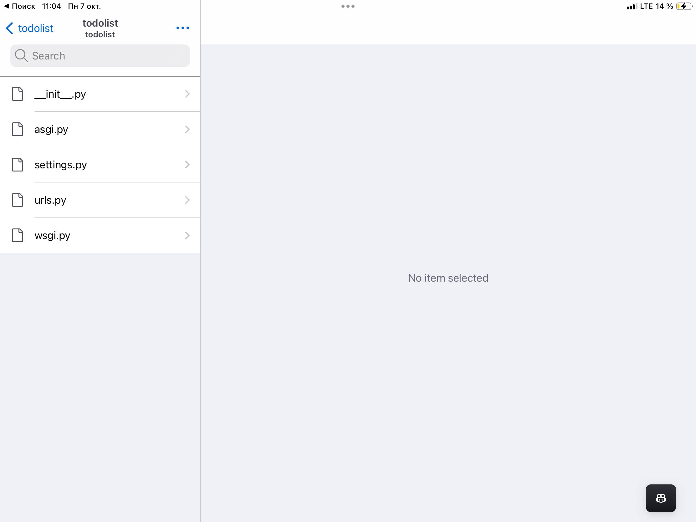
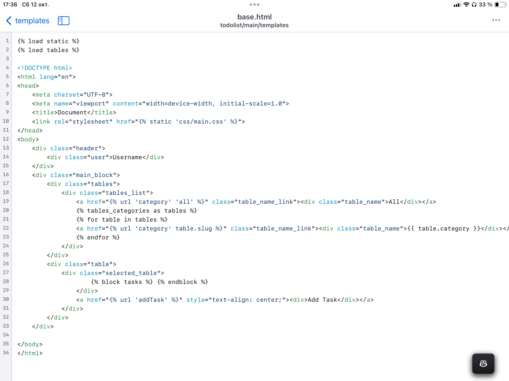

### Создание проекта

Для инициализации проекта Джанго нужно создать папку, открыть терминал по адресу папки и создать виртуальное окружение командой `py -m venv venv`  для Windows и `python3 -m venv venv` для Unix систем. Активируем среду командой `source venv/bin/activate` для Unix и `./venv/Scripts/activate` для Windows. Виртуальная среда нужна для установки необходимых пакетов непосредственно в папку проекта, в противном случае библиотеки будут устанавливаться в корневые папки операционной системы и занимать место.

В дальнейшем вся документация будет ориентирована на Unix системы (отличие в том, что на windows используется py вместо python на Unix системах)


Установим Джанго командой `pip install Django`. После окончания установки пакета пропишем в консоль команду для инициализации проекта `django-admin startproject todolist` создается папка todolist с одноименной папкой todolist, в которой находятся основные файлы проекта. `urls.py` отвечает за маршрутизацию
```python urls.py
from django.contrib import admin
from django.urls import path
from main.urls import patterns

urlpatterns = []
```

`settings.py` отвечает за настройки проекта.
```python 

from pathlib import Path
import os

# Build paths inside the project like this: BASE_DIR / 'subdir'.
BASE_DIR = Path(__file__).resolve().parent.parent


# Quick-start development settings - unsuitable for production
# See https://docs.djangoproject.com/en/4.2/howto/deployment/checklist/

# SECURITY WARNING: keep the secret key used in production secret!
SECRET_KEY = 'django-insecure--*5vl(256%t9td)9+u2uq$d$$n)^*p9i(*e94ibu_&9h4k+(eu'

# SECURITY WARNING: don't run with debug turned on in production!
DEBUG = True

ALLOWED_HOSTS = []


# Application definition

INSTALLED_APPS = [
    'django.contrib.admin',
    'django.contrib.auth',
    'django.contrib.contenttypes',
    'django.contrib.sessions',
    'django.contrib.messages',
    'django.contrib.staticfiles',

    'main',
]

MIDDLEWARE = [
    'django.middleware.security.SecurityMiddleware',
    'django.contrib.sessions.middleware.SessionMiddleware',
    'django.middleware.common.CommonMiddleware',
    'django.middleware.csrf.CsrfViewMiddleware',
    'django.contrib.auth.middleware.AuthenticationMiddleware',
    'django.contrib.messages.middleware.MessageMiddleware',
    'django.middleware.clickjacking.XFrameOptionsMiddleware',
]

ROOT_URLCONF = 'todolist.urls'

TEMPLATES = [
    {
        'BACKEND': 'django.template.backends.django.DjangoTemplates',
        'DIRS': [os.path.join(BASE_DIR, 'templates')],
        'APP_DIRS': True,
        'OPTIONS': {
            'context_processors': [
                'django.template.context_processors.debug',
                'django.template.context_processors.request',
                'django.contrib.auth.context_processors.auth',
                'django.contrib.messages.context_processors.messages',
            ],
        },
    },
]

WSGI_APPLICATION = 'todolist.wsgi.application'


# Database
# https://docs.djangoproject.com/en/4.2/ref/settings/#databases

DATABASES = {
    'default': {
        'ENGINE': 'django.db.backends.sqlite3',
        'NAME': BASE_DIR / 'db.sqlite3',
    }
}


# Password validation
# https://docs.djangoproject.com/en/4.2/ref/settings/#auth-password-validators

AUTH_PASSWORD_VALIDATORS = [
    {
        'NAME': 'django.contrib.auth.password_validation.UserAttributeSimilarityValidator',
    },
    {
        'NAME': 'django.contrib.auth.password_validation.MinimumLengthValidator',
    },
    {
        'NAME': 'django.contrib.auth.password_validation.CommonPasswordValidator',
    },
    {
        'NAME': 'django.contrib.auth.password_validation.NumericPasswordValidator',
    },
]


# Internationalization
# https://docs.djangoproject.com/en/4.2/topics/i18n/

LANGUAGE_CODE = 'en-us'

TIME_ZONE = 'UTC'

USE_I18N = True

USE_TZ = True


# Static files (CSS, JavaScript, Images)
# https://docs.djangoproject.com/en/4.2/howto/static-files/

STATIC_URL = '/static/'

STATICFILES_DIRS = [
    BASE_DIR / 'static'
]
````



Остальные файлы идут как вспомогательные.


Создадим приложение `main` где будет содержаться вся логика проекта внутри проекта. Для этого нужно перейти в директорию проекта Джанго: `cd ./todolist`. 
Пропишем `django-admin startapp main` для создания приложения. Создастся папка `main`  где будет писаться вся логика проекта.


Структура папки main


Чтобы Django видел наше приложение, необходимо подключить его в настройках проекта, в файле `settings.py` в массив `INSTALLED_APPS`:

``` python
INSTALLED_APPS = [
    'django.contrib.admin',
    'django.contrib.auth',
    'django.contrib.contenttypes',
    'django.contrib.sessions',
    'django.contrib.messages',
    'django.contrib.staticfiles',

    'main',
]
````


### Models

Пропишем в файле models.py таблицы баз данных, необходимых для проекта. Таблицу Task - для задач, с полями заголовка, описания, даты создания и категории(значение этого поля связано с значением айди категории задачи) и Tables - с полями названия категории и так называемого slug’а - он нужен для формирования динамических ссылок.

```python
from django.db import models

# Create your models here.

from django.db import models
# Create your models here.


class Tables(models.Model):
    category = models.CharField(max_length=200, verbose_name='Категория')
    slug = models.SlugField(max_length=400)

    class Meta:
        db_table = "Tables"
        verbose_name = "Категорию"
        verbose_name_plural = "Категории"

    def __str__(self):
        return self.category


class Tasks(models.Model):
	title = models.CharField(max_length=200, null=False,        verbose_name="Заголовок")
    discription = models.CharField(max_length=1000, null=False, verbose_name="Описание")
    date = models.DateTimeField(verbose_name="Дата создания", auto_now_add=True)
    category = models.ForeignKey(to=Tables, on_delete=models.CASCADE, verbose_name='Категория')

    class Meta:
        db_table = "Tasks"
        verbose_name = "Задачу"
        verbose_name_plural = "Задачи"

    def __str__(self):
        return self.title
```

Класс `Meta`  описывает корректность перевода в админ панели, атрибут `__str__` отрисовывает нужные поля из таблицы в админ панели, например в нашем случае будет отрисовываться названия задач и категорий. 

 Проверим изменения sql-таблиц командой `python3 manage.pymakemigrations` и сохраним их командой `python3 manage.py migrate`.

Зарегистрируем модели в админ панели. В файле `admin.py` пропишем:
``` python
from django.contrib import admin

# Register your models here.


from django.contrib import admin
from .models import Tasks, Tables
# Register your models here.


@admin.register(Tasks)
class TasksAdmin(admin.ModelAdmin):
    pass

@admin.register(Tables)
class TablesAdmin(admin.ModelAdmin):
    prepopulated_fields = {"slug" : ("category", )}
```

Последняя строка позволяет автоматически генерировать slug по названию категории, например для  категории  `Личное` слаг будет `lichnoe`

### HTML

Далее я прописал html-шаблон проекта. Шаблоны позволяют не прописывать один и тот же html-код несколько раз. Например, можно прописать фон веб сайта и мере нужды менять элементы на странице.  

В директории проекта я создал папку `templates` - в ней содержатся все файлы для визуала сайта. В файле `base.html` прописана основная страница(фон)



Код в начале файла подключает стили и созданный мною тег(о нем далее). Далее весь код внутри фигурных скобках получает значения из get-запросов и отрисовывает полученные значения. 

### Views


Теперь поговорим о самих запросах. Все они пишутся в файле `views.py`:

```python 
def filter_url(request, slug='all'):
    try:
        *table* = Tables.objects.get(slug=slug)
        category = table.category
        tasks = Tasks.objects.filter(category=table.id)
    except:
        tasks = Tasks.objects.all()
        category = 'All'

    context = {
        'tasks': tasks,
        'table_name': category
    }

    return render(request, 'show_tasks.html', context)


def task_menu(request, task_id):
    task = Tasks.objects.get(id=task_id)

    context = {
        'task_data': task
    }

    return render(request, 'task_data.html', context)


def remove_task(request, task_id):
    object = Tasks.objects.get(id=task_id).delete()

    return HttpResponseRedirect('/categories/all')


def edit(request, task_id):
    object = Tasks.objects.get(id=task_id)

    context = {
        'task_data': object
    }

    return render(request, 'edit.html', context)


def save(request, task_id):
    object = Tasks.objects.get(id=task_id)

    if request.method == 'POST':
        object.title = request.POST.get("title")
        object.discription = request.POST.get('discription')

        object.save()
        return HttpResponseRedirect('/categories/all')


def addTask(request):
    categories = Tables.objects.all()
    context = {
        "categories": categories
    }

    return render(request, 'addTask.html', context)


def saveTasks(request):
    if request.method == 'POST':
        title = request.POST.get('title')
        discription = request.POST.get('description')
        data = request.POST.get('date')
        category = request.POST.get('category')
        print(category)

        table = Tables.objects.get(category=category)

        task = Tasks()
        task.title = title
        task.discription = discription
        task.data = data

        task.category_id = table.id

        task.category_id = table.id

        if category:
            task.save()


            return HttpResponseRedirect('/categories/all')
````


#### Функции файла views.py

Рассмотрим файл поподробнее. Функция `filter_url`  отвечает за сортировку задач по категориями. 

```python
def filter_url(request, slug='all'):
    try:
        table = Tables.objects.get(slug=slug)
        category = table.category
        tasks = Tasks.objects.filter(category=table.id)
    except:
        tasks = Tasks.objects.all()
        category = 'All'

    context = {
        'tasks': tasks,
        'table_name': category
    }

    return render(request, 'show_tasks.html', context)
````

Функция получает на вход slug, после чего мы получаем значения из таблицы Tables по слагу, получаем категорию задачи и получаем задачи по категории из таблицы Tasks.

 Последней строчкой мы отрисовываем HTML файл `show_tasks.html` и переменной `context` мы передаем в этот файл данные для отрисовки. В данном случае выбранную пользователем категорию и отсортированные по категории задачи:

```django

<div class="selected_table_name">{{table_name}}</div>
<div class="selected_table_tasks">
    
    <div>No tasks are here</div>
    

<a href="">
    <div class="selected_table_task">
        <div class="task number">{{ forloop.counter }}</div>
        <div class="task title">{{ task.title }}</div>
        <div class="task discription">{{ task.discription|truncatechars_html:45 }}</div>
        <div class="task data">{{ task.date }}</div>
    </div>
</a>

</div>

````

Фигурными скобочками мы создаем как бы переменную(название после слова `block`). В двойные фигурные скобки прописывается ключ из переменной `context`, а в html отрисовывается значение этого ключа. Далее прописывается условие наличия задач и отрисовка сообщения в случае отсутствия задач или самих задач.

Цикл, который получает на вход массив из значения ключа `tasks` переменной `context` и отрисовывает данные для каждой задачи.


Функция `task_data` отрисовывает данные задачи на странице с подробным описанием задачи.

```python

def task_menu(request, task_id):
    task = Tasks.objects.get(id=task_id)

    context = {
        'task_data': task
    }

    return render(request, 'task_data.html', context)


````

На вход получаем Id задачи и получаем непосредственно задачу по этому айди и рендерим файл, передаем переменную `context` массив данных полученной задачи

Файл `task_data.html`


```django
<div class="task_data">
    <b>Title: </b> {{ task_data.title }}<br>
    <b>Discription: </b> {{ task_data.discription }}<br>
    <b>Date of create: </b> {{ task_data.date }}<br>
</div>


<a href="">
    <div>remove</div>
</a>
<a href="">
    <div>edit</div>
</a>
```

Функции `edit`, `remove_task`, `save`:

```python

def remove_task(request, task_id):
    object = Tasks.objects.get(id=task_id).delete()

    return HttpResponseRedirect('/categories/all')


def edit(request, task_id):
    object = Tasks.objects.get(id=task_id)

    context = {
        'task_data': object
    }

    return render(request, 'edit.html', context)


def save(request, task_id):
    object = Tasks.objects.get(id=task_id)

    if request.method == 'POST':
        object.title = request.POST.get("title")
        object.discription = request.POST.get('discription')

        object.save()
        return HttpResponseRedirect('/categories/all')

````


Методы в этих функциях аналогичны предыдущим: на вход идет id задачи и по нему получаются все данные для изменения или удаления задачи.

Функции `saveTasks` и `addTask` отвечают за создание и сохранение задач

```python
def addTask(request):
    categories = Tables.objects.all()
    context = {
        "categories": categories
    }

    return render(request, 'addTask.html', context)


def saveTasks(request):
    if request.method == 'POST':
        title = request.POST.get('title')
        discription = request.POST.get('description')
        data = request.POST.get('date')
        category = request.POST.get('category')
        print(category)

        table = Tables.objects.get(category=category)

        task = Tasks()
        task.title = title
        task.discription = discription
        task.data = data

        task.category_id = table.id

        if category:
            task.save()

            return HttpResponseRedirect('/categories/all')
````


Функции работают аналогично
